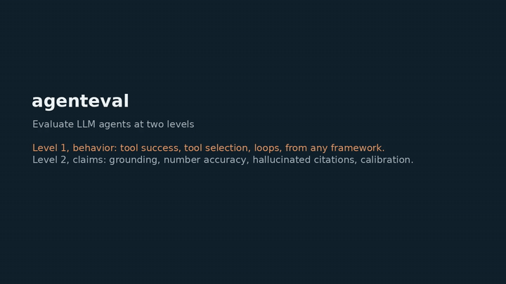

# agenteval

**Evaluate LLM agents at two levels.** Level 1 scores how an agent behaves (tool calls, loops, task success) from traces of LangGraph, LlamaIndex or OpenAI tool-calling runs. Level 2 scores what it says (citations that exist, numbers that match the source, calibrated confidence). Most evaluation tooling covers one of the two, for one framework.

| Level | Question | Input | Command |
|---|---|---|---|
| **Behavior** | Did the agent act well? | Traces from LangGraph, LlamaIndex or OpenAI tool-calling | `agenteval behavior` |
| **Claims** | Can what it said be trusted? | The agent's claims with citations, numbers and confidence | `agenteval claims` |

## Demo



Both levels on the bundled samples: the behavior scorecard per framework, then the claims leaderboard, which picks up a planted wrong number and a planted citation that does not exist. The video is on [anhduongvo.github.io](https://anhduongvo.github.io/projects/agentic-tooling/).

## Level 1: behavior (framework-agnostic)

One run schema (`AgentRun`), adapters that normalise each framework's trace into it, and behavioral metrics:

| Metric | Question | Better |
|---|---|---|
| Tool success rate | Do tool calls run without error? | higher |
| Tool selection accuracy | Were the expected tools actually used? | higher |
| Grounding rate | Is every cited source one that was retrieved? | higher |
| Task success rate | Did the run accomplish the task (gold label)? | higher |
| Mean steps | How many steps per run? | context |
| Loop rate | Does it repeat the same tool call back to back? | lower |

Adapters take the plain trace dict each framework emits, so agenteval does not depend on those frameworks being installed: `from_openai` (chat messages with `tool_calls` and `role: "tool"` results), `from_langgraph` (node `events`), `from_llamaindex` (agent `steps`). Shapes are documented in `adapters.py`, with a runnable example per framework in `data/sample_traces.jsonl`.

## Level 2: claims (grounding, numbers, calibration)

For clinical use the output has to be checkable claim by claim. The `agenteval.clinical` layer scores each claim an agent makes against the sources it had:

| Metric | Question | Better |
|---|---|---|
| Grounding rate | Does every claim cite a source that exists? | higher |
| Hallucinated-citation rate | How many cited ids do not exist? | lower |
| Number accuracy | Do asserted numbers match the cited source value (rounding tolerated, sign flips not)? | higher |
| Calibration (ECE, Brier) | Does a stated confidence match how often it is right? | lower |

One small schema (`Record` with `sources` and `Claim`s carrying `citations`, `numbers`, `confidence`, `label`) fits any agent: transcript lines, FHIR facts, table rows or literature ids are the sources; note sentences, eligibility verdicts, drafted claims or ranked statements are the claims. Bundled samples for four clinical agents are in `data/clinical_samples/`, and `agenteval claims` renders a per-task leaderboard (markdown or HTML).

## Quickstart

```bash
pip install -e ".[dev]"

agenteval behavior data/sample_traces.jsonl                        # per-framework behavior scorecard
agenteval claims data/clinical_samples --md leaderboard.md         # per-task claims leaderboard
```

## Development

```bash
ruff check .
pytest            # behavior adapters + metrics, and claim-level metrics with known-value tests
```

## License

Apache-2.0.
